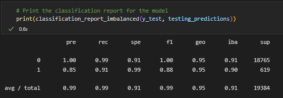
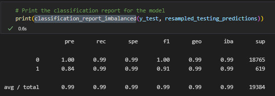

# Module 12 Report - Supervised Learning

## Overview of the Analysis

* Purpose: analyze loan data to create a machine learning model that predicts good versus bad loans
* Data used includes loan size,interest rate,borrower income,debt to income ratio, num of accounts, derogatory marks, total debt
* Split the Data into Training and Testing Sets
* Create a Logistic Regression Model with the Original Data
* Predict a Logistic Regression Model with Resampled Training Data
* Write a Credit Risk Analysis Report

## Results

Balanced accuracy scores and the precision and recall scores summary.

* Machine Learning Model 1:

* Machine Learning Model 2:

## Summary

`0` represents a good loan, and `1` represents bad loans. It is important to correctly predict both because both a false negative and a false postive come with a cost. In this framing a false negative would be having the model predict `0`, and the bank would issue a loan to someone who ultimately defaults. This false negative would cost the bank the remainder of the principal at the point of default, which could be a significant sum.

On the other hand a false postive would be having the model predict `1` and the bank would deny a loan to an individual who would likely pay back the principle and interest. So they would be losing out on a profitable loan, which is costly. 

Given that both false negative and false positives matter, accuracy could be considered the most important consideration for a machine learning model. From this perspective, we should choose the second model.
